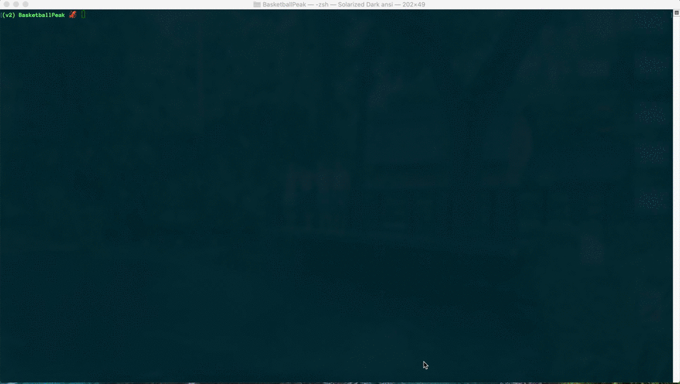

# Basketball Peak Finder

For basketball fans and sports fans who love 
statistics. This application finds the peak 
season of an NBA player's career and displays 
statistics and charts related to that player. 
It can find a player's peak performance in the
regular season and/or the postseason. The peak 
is found by summing a single season's Win 
Shares with PER. The maximum of all the
season's is determined as the peak of that 
player's career.


## Demo




## Warning: 
This application has not been updated
to reflect the change to the Basketball-Reference 
website structure resulting in an error. Please refer
to the demo to see what was once a working application.
   
## Installation

Make sure you have pip or another package manager
to install the neccessary dependencies.

```bash
pip install -r requirements.txt
```

## Usage

The current player database goes up to 2019-20 season.
To update the player database file:
```bash
python players.py
```

To run the application:
```bash
python peak_ui.py
```

## Support

For any suggestons or questions contact me via email: 
jackribarich@yahoo.com

## Author

Jack Ribarich

## Project Status

As of August 2020, the project GUI is finished, however, the 
calculation for the peak of player's career may be adjusted. 
